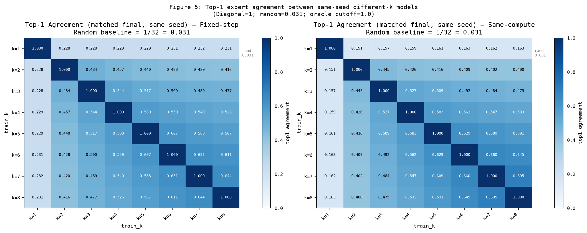
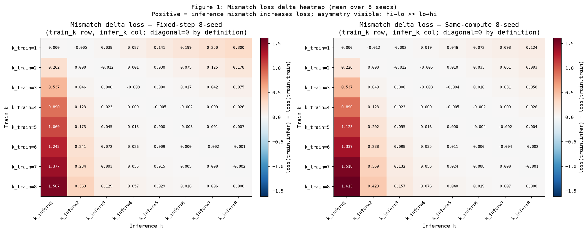
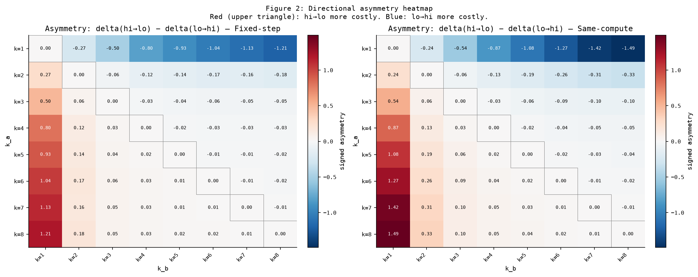
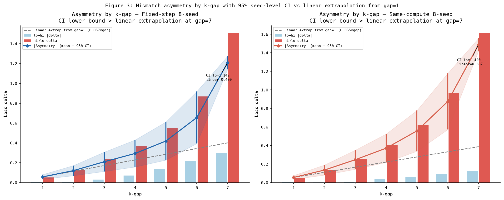
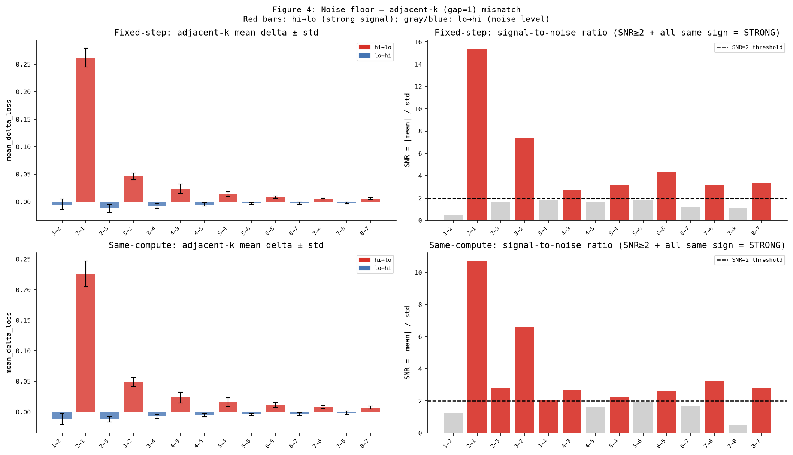
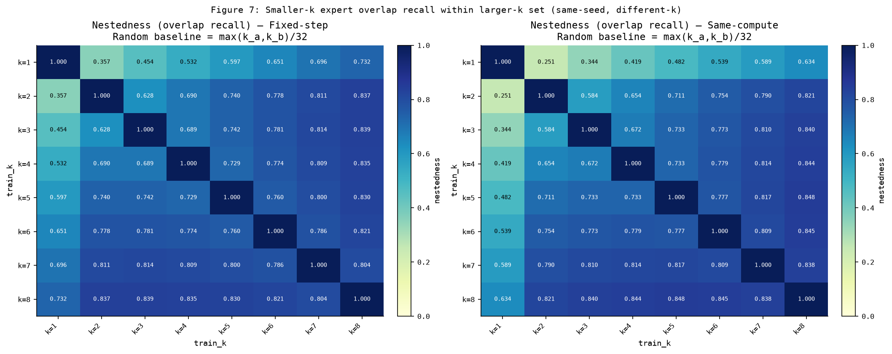
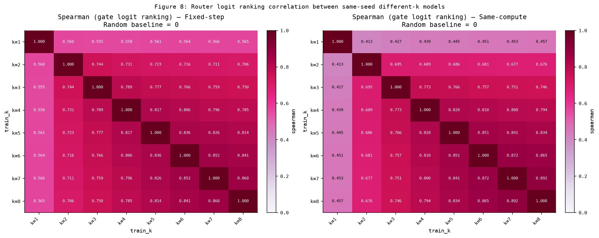
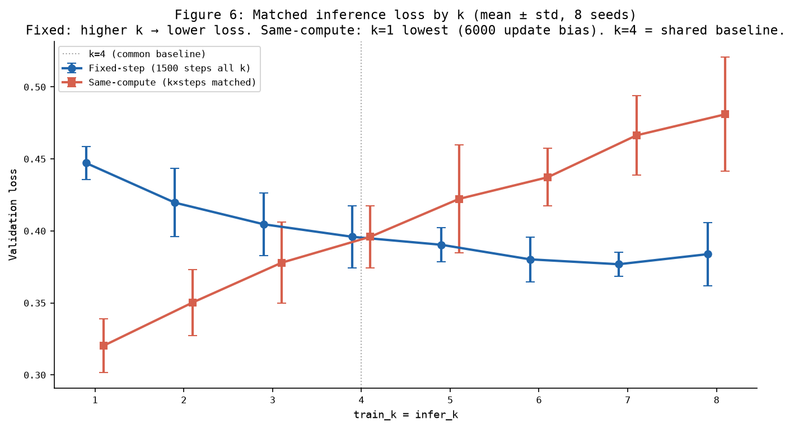

<!-- _class: lead -->

# MoE Top-k Routing 실험

## Train-time k vs Inference-time k 불일치가 routing과 loss에 미치는 영향

**Sparse32 TinyMoE · 8 seeds · Fixed-step & Same-compute**

2026-06-28

---

# Motivation

MoE는 **train-time top-k (k_train)** 와 **inference-time top-k (k_infer)** 를 다르게 설정할 수 있다.

- k=8로 학습 → k=1로 추론 (비용 절감)
- k=1로 학습 → k=4로 추론 (capacity 확장)

**질문**: 이 불일치가 단순 logit cutoff인가, 아니면 routing structure를 재학습하는가?

---

# Research Questions

1. **(a)** k_train ≠ k_infer 일 때 routing structure는 얼마나 diverge하는가?
2. **(b)** validation loss에 얼마나, 어느 **방향**으로 영향을 주는가?
3. **(c)** 이 효과가 training stochasticity를 **초과**하는 진짜 k 효과인가?

---

# Setup

| 항목 | 값 |
|---|---|
| 모델 | TinyMoE Transformer, 8 layers, 32 experts |
| d_model / heads | 192 / 6 |
| seq_len / vocab | 96 / 256 |
| 데이터 | 7 카테고리 × 2500 (합성 템플릿) |
| Seeds | **8** (0..7) |
| GPU | RTX 3080 Ti 12GB |

k_train ∈ {1..8}, k_infer ∈ {1..8} → **64 matched runs × 8 seeds = 512 runs**

---

# Experimental Design: Two Budgets

| 설정 | 모든 k의 step | 의도 |
|---|---|---|
| **Fixed-step** | 1500 step | optimizer update 수 통제 |
| **Same-compute** | k×step 보정 | active expert invocation proxy 통제 |

Same-compute schedule: k=1→6000, k=2→3000, …, k=8→750

**k=4가 두 설정의 공통 기준점** (동일 실험)

---

# Metrics & Sanity Gates

| 지표 | 의미 | Random baseline |
|---|---|---|
| top1_agreement | top-1 expert 일치율 | 1/32 = 0.031 |
| nestedness | smaller-k overlap recall | b/E |
| mismatch_delta | loss(k_infer≠k_train) − matched | 0 |
| asymmetry | \|Δ(hi→lo) − Δ(lo→hi)\| | 0 |

**모든 sanity gate 통과**: logit cutoff = 1.0, step-0 same-W₀ = 1.0, collapsed runs = 0

---

# Routing Alignment: 세 수준 비교

$$\underbrace{0.031}_{\text{random}} \approx \underbrace{0.031}_{\text{cross-seed same-k}} \ll \underbrace{0.15 \sim 0.70}_{\text{same-seed across-k}} \ll \underbrace{1.0}_{\text{oracle cutoff}}$$

| 수준 | 해석 |
|---|---|
| cross-seed ≈ random | MoE permutation symmetry → **예상된 결과** |
| same-seed across-k | k 차이의 **실제 routing 효과** |
| oracle gap (0.30–0.85) | k가 단순 cutoff가 **아님** — priority 재구성 |

---

# Routing Alignment (same-seed across-k)

Random baseline 대비 top1_agreement:

| pair | Fixed-step | Same-compute |
|---|---:|---:|
| 1-2 | **7.3×** | 4.8× |
| 4-8 | **16.8×** | 17.1× |
| 7-8 | **20.6×** | 22.2× |

- k 간격이 좁을수록 alignment ↑ (인접 k는 유사)
- k=1 관련 pair는 random 대비 5–7× (상대적으로 낮음)
- **28 pair × 8 seeds 모두** candidate direction check 통과

---

# Top-1 Agreement Heatmap



색이 진할수록 top-1 expert 일치율 ↑  
하단 우측(high-k 간) 진함 · k=1 행/열 옅음

---

# Mismatch Cost: 핵심 수치

**train_k=8, infer_k=1** (hi→lo, 가장 큰 비용):

| Budget | mean Δloss | matched loss (k=8) |
|---|---:|---:|
| Fixed-step | **+1.507** | 0.384 |
| Same-compute | **+1.613** | 0.481 |

→ inferred loss ≈ 0.384 + 1.507 = **1.891** (matched 대비 ~392% 증가)

반대 방향 (1→8): +0.300 / +0.124 — **5–13× 비대칭**

---

# Mismatch Delta Heatmap



행=train_k, 열=infer_k · 대각선=0 (matched)  
**왼쪽 열(hi→lo) 전체가 짙은 빨강** → hi→lo 비용이 지배적

---

# Asymmetry: hi→lo ≫ lo→hi



- **8/8 seeds** hi→lo > lo→hi (gap ≥ 2, 두 budget 공통)
- gap=7 asymmetry: fixed **1.21**, same-compute **1.49**
- 95% CI lower bound > linear extrapolation (gap=7에서만 통계적 확인)

---

# Asymmetry by K-gap (95% CI)



gap=7에서 CI lower (1.14 / 1.42) > linear pred (0.40 / 0.39)  
→ "초선형 법칙"이 아니라 **"gap=7에서 선형 외삽 초과"** 로 표현

---

# Noise Floor: gap=1도 방향에 따라 다름

| 방향 | gap=1 SNR | 8/8 seeds | 해석 |
|---|---|---|---|
| **hi→lo** | 3–15 | 모두 양수 | **강한 신호** |
| lo→hi | 0.5–1.8 | 부호 혼재 | noise 수준 |

> "인접 k 전환은 안전하다" → **lo→hi에만** 해당  
> hi→lo는 gap=1에서도 비용 있음

---

# Noise Floor Chart



SNR=2 점선 위 빨강(hi→lo)만 STRONG · lo→hi는 대부분 noise

---

# Nestedness Heatmap



overlap recall · random = max(k)/32 · excess 0.19–0.59

---

# Spearman Heatmap



Gate logit **ranking** correlation · random=0 · 7-8: 0.86–0.89 · k=1 관련: 0.41–0.56

---

# Matched Loss Context



- Fixed-step: k ↑ → loss ↓ (더 많은 expert 활용)
- Same-compute: k=1이 가장 낮음 (6000 steps 수렴 효과)
- k=4에서 두 budget 교차

**k=8 matched loss(0.384) < k=1(0.447)** 이지만, k=8→1 mismatch는 +1.507

---

# Evidence Summary

| Claim | 강도 | 핵심 수치 |
|---|---|---|
| k가 routing priority 재구성 | **강함** | oracle gap 0.30–0.85 |
| hi→lo > lo→hi | **가장 강함** | 8/8 unanimity, 5–13× |
| k=8→1 mismatch cost | **강함** | +1.507 / +1.613 |
| lo→hi gap=1 safe | **중간** | SNR < 2 |
| hi→lo gap=1 costly | **강함** | SNR 3–15 |
| two-budget 재현 | **강함** | 방향 동일 |

---

# Limitations & 금지 표현

**한계**
- 합성 소규모 scratch 모델 → pretrained MoE 일반화 미검증
- routing–loss 상관만 확인, **인과 ablation 없음**
- same-compute는 active invocation만 통제 (optimizer update 수는 k별 상이)

**주의할 표현**
- ❌ "k=1→2로 성능 향상" (noise)
- ❌ "asymmetry가 power-law" (gap=7만 CI 확인)
- ❌ "routing divergence가 mismatch 원인" (n=8, 상관만)

---

<!-- _class: lead -->

# Takeaway

> **High-k로 학습한 MoE를 low-k로 추론(hi→lo)하면 validation loss가 크게 악화된다.**  
> k=8 matched loss(0.384)가 k=1(0.447)보다 낮아도, k=8→1 mismatch는 **+1.507**.  
> 이 **비대칭성**은 fixed-step·same-compute 두 budget, 8 seeds 모두에서 재현.

**다음 단계**: inference top-k 구현 명시, causal ablation (router transplant)

---

# Appendix: 재현 & 자료

```bash
# Baseline analysis
python scripts/analyze_training_variability_null.py \
  --run-dir /tmp/.../sparse32_kgrid_fixed_step_8seed/... \
  --out-dir results/baselines/fixed_step_8seed --n-experts 32
```

- 전체 보고서: `docs/sparse32_full_report.md`
- 베이스라인: `docs/sparse32_baseline_analysis.md`
- 그림: `results/report_figures/`
